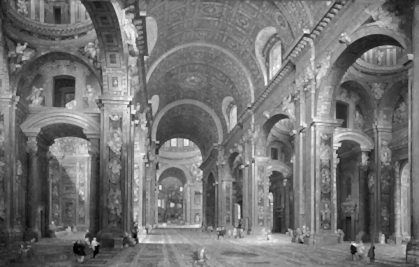
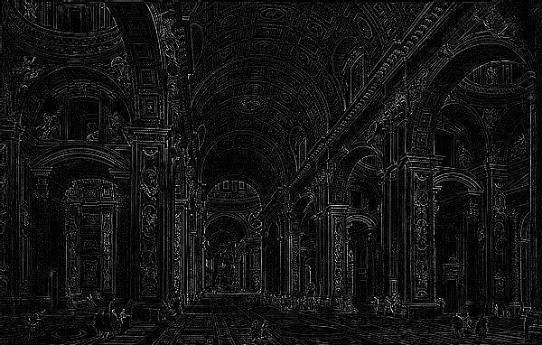
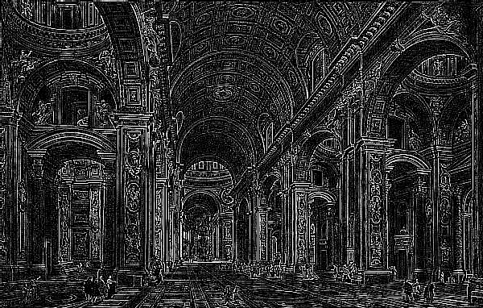

# Special Project HW2

## Introduction

All the test results are stored in [sellylu/HW2/Result/](https://github.com/sellylu/HW2/tree/master/Result).

Since I'm using MacBook, I import libraries of opencv with directly creating CMakeLists.txt. If it's possible for Windows or Linux Ubuntu users to use `cmake`, following steps below might be possible re-compile and run exacutable files in other operating systems.

```shell
cd <dir>
cmake .
make
./<executable_file>
```

## Specification

1. **Linear Filter:** processing on the pictures with random size filter in linear way, such as box filter.
2. **Non-linear Filter:** processing on the pictures of any size filter in non-linear way, such as median or max/min filter.
3. **Special Filter:** processing on the pitures with following stated filter, Gaussian, Laplacian, and Sobel.

## Concept Development

Before doing all three questions, we know that all works are not only related to 2D convolution, but we also need to consider about padding. When processing convolution on the boundary, there's acutally no related pixel for outer the original picture. Thus, we need to pad the exceed part with logical value. We choose to do mirror padding here which means the padding elements contain mirror copies of the original picture.

1. **Linear Filter**

	Linear filter is actually quite easy to fulfill. It is just doing 2D convolution with filter as impulse response. We can iteratively cover filter on unprocessed picture and multiply filter with matched pixel following definition of covolution. The summation of the product right results in value of the center pixel.
	
2. **Non-linear Filter**

	Non-linear filter means that the result and original picture cannot find linear relation. One simple non-linear filter is order-statistic filter. As how we begin with linear filter, choosing the size of filter window and iterating through the picture. The result value here is then the one that chosen according to statistic property, such as max, min, or median, with all filter-covered value that have been sorted.
	
3. **Special Filter**
	
	The special filters that we're going to implement are all linear filters as well. On behalf of sobel, we should do it with two direction at first. And then, combining the result of two directional sobel filter as stated below:
	$$\nabla f = \mathrm{mag}(\nabla \mathbf{f}) = \sqrt{(\frac{\partial f}{\partial x})^2 + (\frac{\partial f}{\partial y})^2} = \sqrt{(G_x)^2 + (G_y)^2}$$

## Implementation

With the help of example code, we can see padding has been packed into a function. We only need to call `padding(cv::Mat* input, cv::Mat* pad, int step)` afterward.

1. **Linear Filter**

	Similar to box filter in example, but I let the configuration file pass in a file name, and read the filter value from that file.
	
	I also packed 2D convolution into a function `void ImgProc::Convolution2D(int offset, cv::Mat *pad)`. Whenever needing to do convolution, we can utilize this with `padding(...)`.

2. **Non-linear Filter**

	The key point of non-linear filter is sorting. I also create a function `template<class T> void insertion(std::vector<T> &cont, T value)` to do sortin upon insertion. After all position of the filter is insert to the sorted vector, we pick out the assigned order for result.
	
3. **Special Filter**

	As described in [Concept Development](https://github.com/sellylu/HW2/blob/master/README.md#concept-development), we can utilize function from question 1 directly, except for sobel filter. Once we read command to implement sobel filter, we take out the value of x and y direction to combine.
	
## Discussion

1. **Linear Filter**
	
	We can find here these filters with all positive value are mostly used to blur the image, that is, so call smoothing spatial filters. Though we might found the result of any kind of these filters be very similar with each other, respected to following detail we can still tell a little difference between them. Gaussian and weighted filter seems to strengthen the contrast.
	
	
	
	
	
2. **Non-linear Filter**

	With expectation to having result of max filter to be darker nad min filter to be lighter, we got the result successfully. Besides, we can also find that images been through minimun and maximun filter seems to have visible texture of window size block, while median filter doesn't.

	\- 3\*3 Minimum Filter
	
	\- 3\*3 Median Filter
	
	\- 3\*3 Maximum Filter
	

3. **Special Filter**

	Compare the result of soble and laplacian filter, we can find the difference between first order differential and second order differential. Single Sobel filter seems to only process on single direction. If we want to get full direction edge, we have to combine two direction like [Concept Development](https://github.com/sellylu/HW2/blob/master/README.md#concept-development) stated. On the other hand, Laplacian filter has already have all direction edge. It might be because of the property of differentiation.

	\- Sobel Filter in X
	
	\- Sobel Filter
	
	\- Sobel Filter in Y
	

	\- Laplacian Filter
	
	
	

## Reference

- R\. C. Gonzalez, R. E. Woods, *"Digital Image Processing"*

<style TYPE="text/css">
code.has-jax {font: inherit; font-size: 100%; background: inherit; border: inherit;}
</style>
<script type="text/x-mathjax-config">
MathJax.Hub.Config({
    tex2jax: {
        inlineMath: [['$','$'], ['\\(','\\)']],
        skipTags: ['script', 'noscript', 'style', 'textarea', 'pre'] // removed 'code' entry
    }
});
MathJax.Hub.Queue(function() {
    var all = MathJax.Hub.getAllJax(), i;
    for(i = 0; i < all.length; i += 1) {
        all[i].SourceElement().parentNode.className += ' has-jax';
    }
});
</script>
<script type="text/javascript" src="http://cdn.mathjax.org/mathjax/latest/MathJax.js?config=TeX-AMS-MML_HTMLorMML"></script>